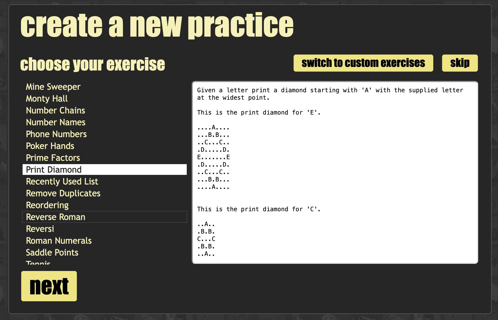
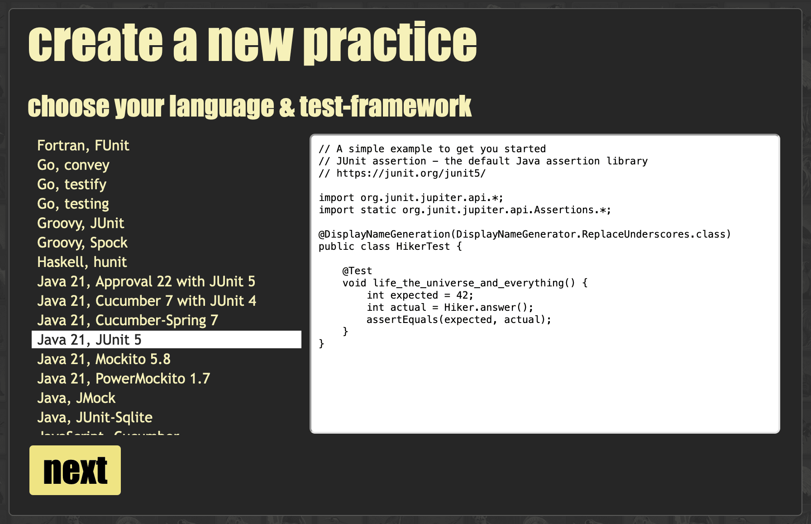

- A [docker-containerized](https://registry.hub.docker.com/r/cyberdojo/creator) micro-service for [https://cyber-dojo.org](http://cyber-dojo.org).
- The UI to configure and create (or re-enter) a group-exercise or an individual-exercise.
- Demonstrates a [Kosli](https://www.kosli.com/) instrumented [GitLab CI pipeline](https://app.kosli.com/cyber-dojo/flows/creator-ci/trails/) 
  deploying to [staging](https://app.kosli.com/cyber-dojo/environments/aws-beta/snapshots/) and [production](https://app.kosli.com/cyber-dojo/environments/aws-prod/snapshots/) AWS environments.

- - - -

