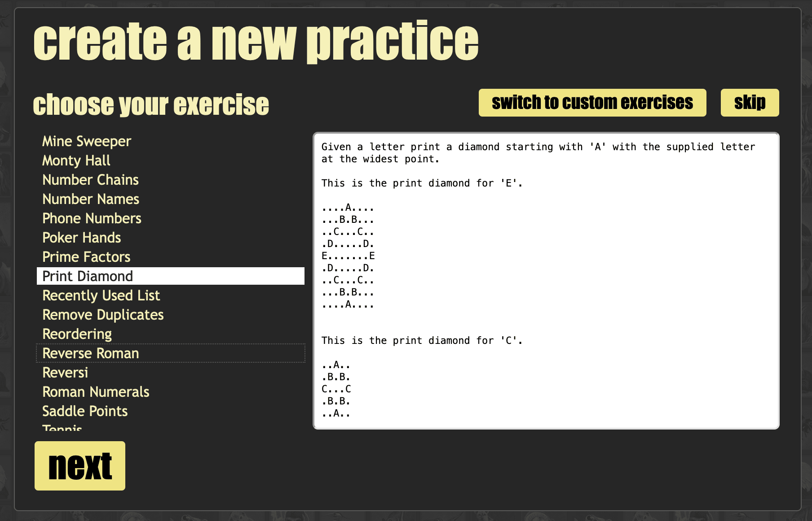
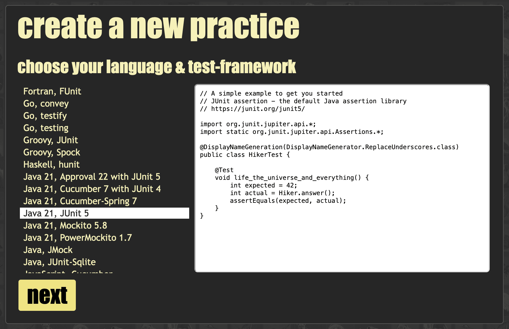

[](https://github.com/cyber-dojo/creator/actions)

- A [docker-containerized](https://registry.hub.docker.com/r/cyberdojo/creator) micro-service for [https://cyber-dojo.org](http://cyber-dojo.org).
- The UI to configure and create (or re-enter) a group-exercise or an individual-exercise.
- Demonstrates a [Kosli](https://www.kosli.com/) instrumented [GitHub Actions pipeline](https://app.kosli.com/cyber-dojo/flows/creator-ci/trails/) 
  deploying to [staging](https://app.kosli.com/cyber-dojo/environments/aws-beta/snapshots/) AWS environment.

# Development

There are two sets of tests:
- server: these run from inside the creator container
- client: these run from outside the creator container, driving the pages via Selenium

```bash
# Build the creator image
$ make image

# Run all the tests (server and client)
$ make test

# Run only the server (or client) tests
$ make {test_server|test_client}

# Run only tests whose id starts with p42
# (tids takes one or more space-separated id prefixes)
$ make {test_server|test_client} tids=p42
$ make {test_server|test_client} tids="p42 p9F"

# Bring up a full local demo (creator + web behind the real nginx)
$ make demo
```

The source is bind-mounted read-only into the containers, so edits to
`source/server/creator/` (or `source/client/`) and `test/` are picked up by
re-running the tests - no `make image` rebuild needed.

- - - -


